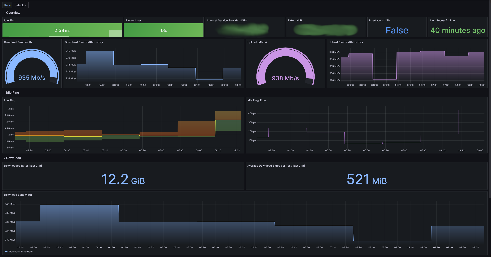

# Speed Test Exporter
Runs a [Ookla Speedtest®](https://www.speedtest.net/) at regular intervals and exports the results in Prometheus format.



## Config
Configuration is through the following environment variables

|Env Var|Description|Type|Default|
|-|-|-|-|
|`SPEEDTEST_DEBUG`|Enables debug logs|bool|`false`|
|`SPEEDTEST_LISTEN_PORT`|Listen port for metrics|int|`8080`|
|`SPEEDTEST_INTERVAL_SECONDS`|Time period between tests, in seconds|int|`3600`|
|`SPEEDTEST_NAME_LABEL`|Value that is filled in for `name` label on all metrics.  Intended to be used to distinguish between tests in different environments.|string|`default`|

## Prometheus Configuration

Example Prometheus configuration (assuming Prometheus is running on the same host machine):

```yaml
scrape_configs:
  - job_name: speedtest
    metrics_path: /metrics
    static_configs:
      - targets:
        - 127.0.0.1:8080
    scrape_interval: 30s
    scrape_timeout: 10s
```

## Install and Deploy

### Docker Compose
```yaml
services:
  speedtest-exporter:
      expose:
        - 8080
      ports:
        - 8080:8080
      image: ghcr.io/bartlettc22/speedtest-exporter:v0.2.0
      environment:
        # Default 1hr
        - SPEEDTEST_INTERVAL_SECONDS=3600
        - SPEEDTEST_DEBUG=0
```

Docker compose file can also be found at [deploy/compose/compose.yaml](deploy/compose/compose.yaml)

### Helm
Speedtest Export can be installed into Kubernetes via Helm.

```bash
git clone https://github.com/bartlettc22/speedtest-exporter.git
cd speedtest-exporter/deploy/chart

helm upgrade --install speedtest-exporter ./
```

See [deploy/chart](deploy/chart) for more details on Helm values.

## Grafana Dashboard
Dashboard can be downloaded and imported at [dashboard/dashboard.json](dashboard/dashboard.json)

## Metrics
Metrics are exposed at `:8080/metrics` by default and provide the following:

```yaml
# HELP speedtest_download_bandwidth The download bandwidth, in bytes/s, of last successful speed test
# TYPE speedtest_download_bandwidth gauge
speedtest_download_bandwidth{name="default"} 1.17641899e+08
# HELP speedtest_download_bytes The downloaded bytes of last successful speed test
# TYPE speedtest_download_bytes counter
speedtest_download_bytes{name="default"} 4.2297528e+08
# HELP speedtest_download_elapsed_seconds The elapsed download time of last successful speed test
# TYPE speedtest_download_elapsed_seconds counter
speedtest_download_elapsed_seconds{name="default"} 3
# HELP speedtest_download_latency_high_seconds The max download latency of last successful speed test
# TYPE speedtest_download_latency_high_seconds gauge
speedtest_download_latency_high_seconds{name="default"} 0.012550000101327896
# HELP speedtest_download_latency_iqm_seconds The download interquartile mean latency of last successful speed test
# TYPE speedtest_download_latency_iqm_seconds gauge
speedtest_download_latency_iqm_seconds{name="default"} 0.0081619992852211
# HELP speedtest_download_latency_jitter_seconds The download latency jitter of last successful speed test
# TYPE speedtest_download_latency_jitter_seconds gauge
speedtest_download_latency_jitter_seconds{name="default"} 0.0007749999640509486
# HELP speedtest_download_latency_low_seconds The min download latency of last successful speed test
# TYPE speedtest_download_latency_low_seconds gauge
speedtest_download_latency_low_seconds{name="default"} 0.0017389999702572823
# HELP speedtest_isp_info Internet service provider info of last successful speed test
# TYPE speedtest_isp_info gauge
speedtest_isp_info{external_ip="x.x.x.x",isp="Comcast",name="default"} 1
# HELP speedtest_last_run_timestamp The timestamp of the last speed test
# TYPE speedtest_last_run_timestamp gauge
speedtest_last_run_timestamp{name="default",status="failed"} 0
speedtest_last_run_timestamp{name="default",status="succeeded"} 1.708965304e+09
# HELP speedtest_packet_loss The packet loss percentage of last successful speed test
# TYPE speedtest_packet_loss gauge
speedtest_packet_loss{name="default"} 0
# HELP speedtest_ping_high_seconds The idle ping min of last successful speed test
# TYPE speedtest_ping_high_seconds gauge
speedtest_ping_high_seconds{name="default"} 0.0020860000513494015
# HELP speedtest_ping_jitter_seconds The idle ping jitter of last successful speed test
# TYPE speedtest_ping_jitter_seconds gauge
speedtest_ping_jitter_seconds{name="default"} 9.200000204145908e-05
# HELP speedtest_ping_latency_seconds The idle ping latency of last successful speed test
# TYPE speedtest_ping_latency_seconds gauge
speedtest_ping_latency_seconds{name="default"} 0.0020129999611526728
# HELP speedtest_ping_low_seconds The idle ping max of last successful speed test
# TYPE speedtest_ping_low_seconds gauge
speedtest_ping_low_seconds{name="default"} 0.0019520000787451863
# HELP speedtest_run_duration_seconds The run duration of the speed tests
# TYPE speedtest_run_duration_seconds histogram
speedtest_run_duration_seconds_bucket{name="default",status="failed",le="0"} 0
speedtest_run_duration_seconds_bucket{name="default",status="failed",le="5"} 0
speedtest_run_duration_seconds_bucket{name="default",status="failed",le="10"} 0
speedtest_run_duration_seconds_bucket{name="default",status="failed",le="15"} 0
speedtest_run_duration_seconds_bucket{name="default",status="failed",le="20"} 0
speedtest_run_duration_seconds_bucket{name="default",status="failed",le="25"} 0
speedtest_run_duration_seconds_bucket{name="default",status="failed",le="30"} 0
speedtest_run_duration_seconds_bucket{name="default",status="failed",le="35"} 0
speedtest_run_duration_seconds_bucket{name="default",status="failed",le="+Inf"} 0
speedtest_run_duration_seconds_sum{name="default",status="failed"} 0
speedtest_run_duration_seconds_count{name="default",status="failed"} 0
speedtest_run_duration_seconds_bucket{name="default",status="succeeded",le="0"} 0
speedtest_run_duration_seconds_bucket{name="default",status="succeeded",le="5"} 0
speedtest_run_duration_seconds_bucket{name="default",status="succeeded",le="10"} 0
speedtest_run_duration_seconds_bucket{name="default",status="succeeded",le="15"} 1
speedtest_run_duration_seconds_bucket{name="default",status="succeeded",le="20"} 1
speedtest_run_duration_seconds_bucket{name="default",status="succeeded",le="25"} 1
speedtest_run_duration_seconds_bucket{name="default",status="succeeded",le="30"} 1
speedtest_run_duration_seconds_bucket{name="default",status="succeeded",le="35"} 1
speedtest_run_duration_seconds_bucket{name="default",status="succeeded",le="+Inf"} 1
speedtest_run_duration_seconds_sum{name="default",status="succeeded"} 10.214874283
speedtest_run_duration_seconds_count{name="default",status="succeeded"} 1
# HELP speedtest_run_total The number of total speed test runs
# TYPE speedtest_run_total counter
speedtest_run_total{name="default",status="failed"} 0
speedtest_run_total{name="default",status="succeeded"} 1
# HELP speedtest_server_info Server info labels of last successful speed test
# TYPE speedtest_server_info gauge
speedtest_server_info{country="United States",host="speedtest-dnvr.mynextlight.net",id="47683",ip="66.186.203.166",location="Denver, CO",name="default",port="8080",server_name="NextLight"} 1
# HELP speedtest_upload_bandwidth The upload bandwidth, in bytes/s, of last successful speed test
# TYPE speedtest_upload_bandwidth gauge
speedtest_upload_bandwidth{name="default"} 1.15625551e+08
# HELP speedtest_upload_bytes The uploaded bytes of last successful speed test
# TYPE speedtest_upload_bytes counter
speedtest_upload_bytes{name="default"} 6.57519155e+08
# HELP speedtest_upload_elapsed_seconds The elapsed upload time of last successful speed test
# TYPE speedtest_upload_elapsed_seconds counter
speedtest_upload_elapsed_seconds{name="default"} 5
# HELP speedtest_upload_latency_high_seconds The max upload latency of last successful speed test
# TYPE speedtest_upload_latency_high_seconds gauge
speedtest_upload_latency_high_seconds{name="default"} 0.09055399894714355
# HELP speedtest_upload_latency_iqm_seconds The upload interquartile mean latency of last successful speed test
# TYPE speedtest_upload_latency_iqm_seconds gauge
speedtest_upload_latency_iqm_seconds{name="default"} 0.0544780008494854
# HELP speedtest_upload_latency_jitter_seconds The upload latency jitter of last successful speed test
# TYPE speedtest_upload_latency_jitter_seconds gauge
speedtest_upload_latency_jitter_seconds{name="default"} 0.007607999723404646
# HELP speedtest_upload_latency_low_seconds The min upload latency of last successful speed test
# TYPE speedtest_upload_latency_low_seconds gauge
speedtest_upload_latency_low_seconds{name="default"} 0.002257999964058399
# HELP speedtest_vpn_status Indicates VPN status of last successful speed test
# TYPE speedtest_vpn_status gauge
speedtest_vpn_status{name="default"} 0
```
